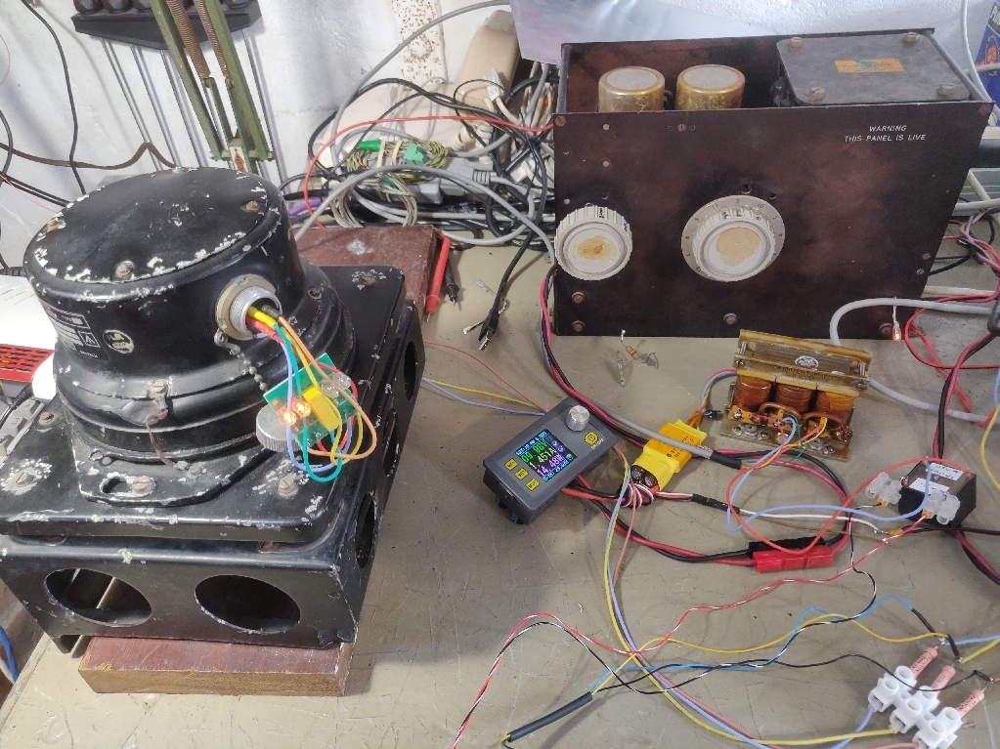
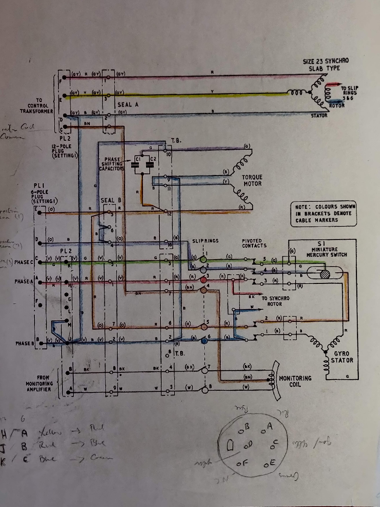
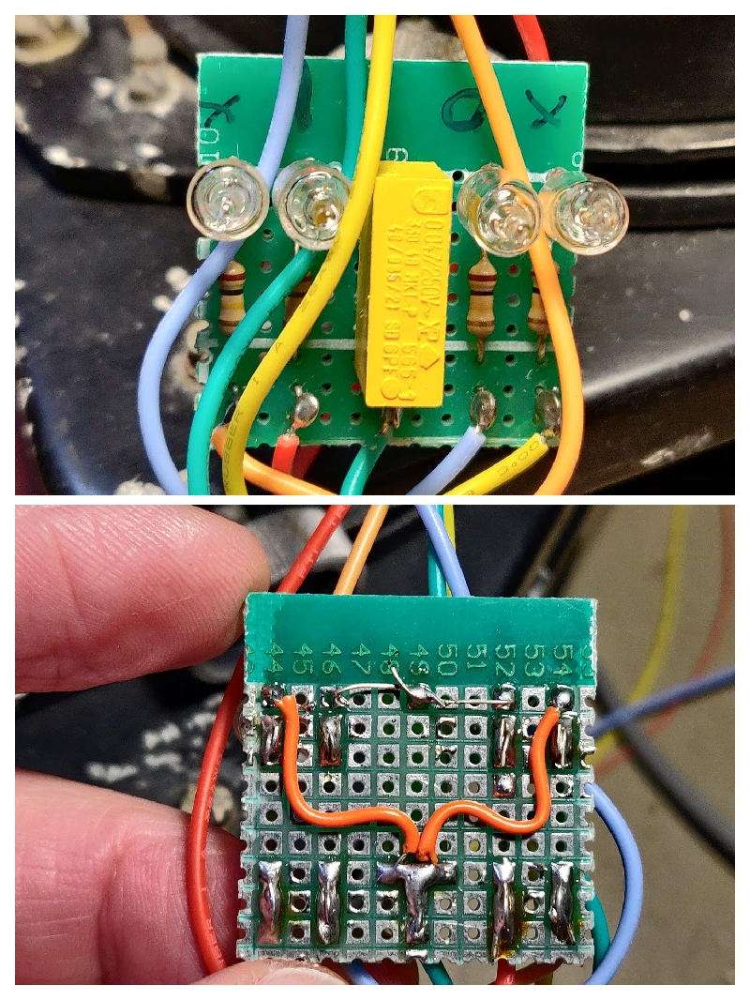
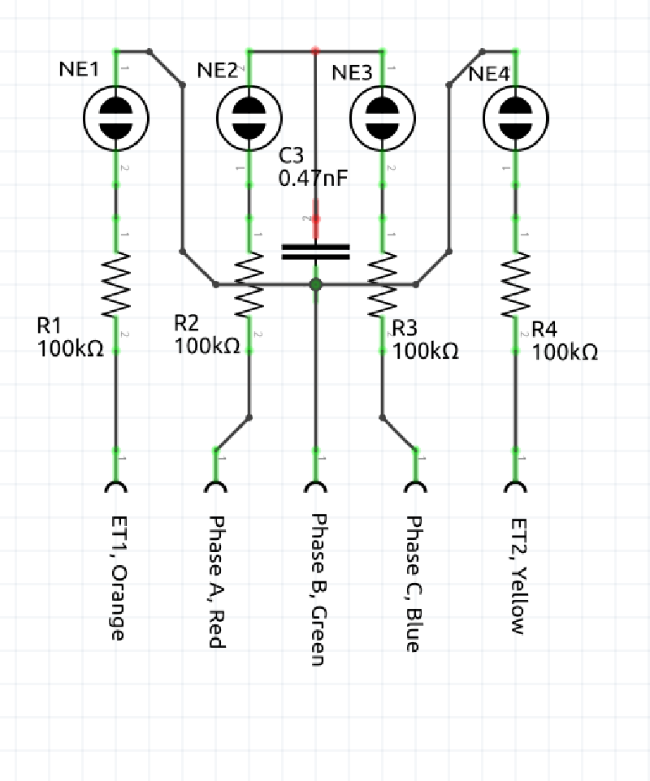

# Aviation_Azimuth_Gyro_KCA_1903
Provides a reference from which the angular movement of an aircraft can be measured. The output signal is derived from a thre line synchro transmitter (90 V. line).

[documents](./documents)

[images](./images)

 * Gyro synchro output test on turntable

[turntable](https://youtu.be/srLLdCGvYok)

### Power supply

 * 115 V, 400 Hz
 * Phase rotation A,B,C
 * Phase B earthed
 

### Connector 12 way

|Pin(12)|Function|
|-------|--------|
|   A   |Monitor|W|
|   B   |Monitor|BK|
|   C   |Monitor Common|BN|
|   D   |Synchro|B|
|   E   |Synchro|Y|
|   F   |SYnchro|R|
|   G   |n/c|-|
|   H   |Phase-A|R|
|   J   |Phase-B|B|
|   K   |Phase-C|G|
|   L   |n/c|-|
|   M   |Link to J|B|

### Connector 6 way

|Pin(12)|Pin(6)|Colour|Name|
|-------|------|------|----|
|H|A|Red|Phase-A|
|J|B|Green|Phase-B|
|K|C|Blue|Common-C|
|-|D|Yellow|Test|
|-|E|Orange|Test|
|-|F|None|n/a|

 * Timelapse video showing drift
[drift](https://youtube.com/shorts/jlOQigvoOJI)

 * Timelapse video showing monitor adjustments
[monitor](https://youtube.com/shorts/bpBCVN842Ug)

 * Realtime video showing erect test outputs 
[erect](https://youtu.be/J3WKJNWqx1A)

 * Outer two neons are erection test lamps, should flash on from time to time.
 * Inner neons, One conected to red wire should be lit, One connected to blue wire should be off. Phase missing or rotation error otherwise.
 

|Rotation|NE2|NE3|
|--------|---|---|
|   A-B-C|On |Off|
|   B-A-C|Off|On |
 

|Erection|NE1|NE4|
|--------|---|---|
|  Steady|Off|Off|
|  Right |On |Off|
|  Left  |Off|On |
 

