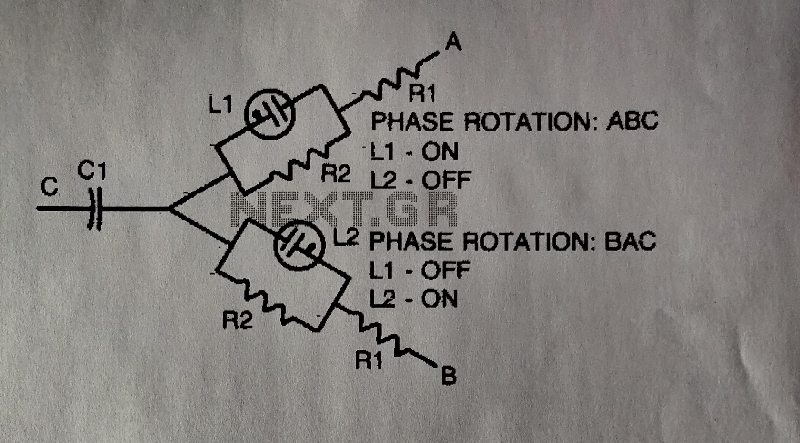

# Aviation_Azimuth_Gyro_KCA_1903
Provides a reference from which the angular movement of an aircraft can be measured. The output signal is derived from a thre line synchro transmitter (90 V. line).

[documents](./documents)

[images](./images)

