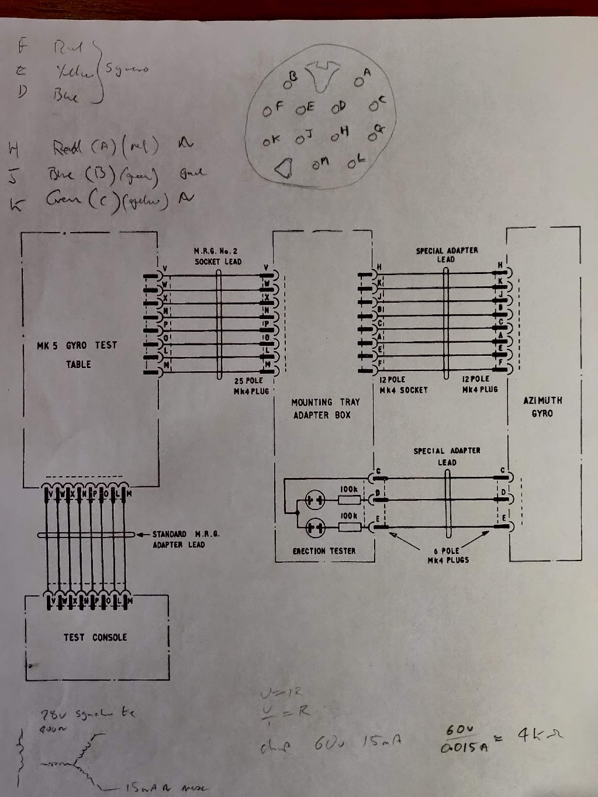

# Aviation_Azimuth_Gyro_KCA_1903
Provides a reference from which the angular movement of an aircraft can be measured. The output signal is derived from a thre line synchro transmitter (90 V. line).

[documents](./documents)

[images](./images)

[video](https://youtu.be/J3WKJNWqx1A)

|Pin(12)|Pin(6)|Colour|Name|
|-------|------|------|----|
|-|E|Orange|Test|
|H|A|Red|Phase|
|J|B|Green|Phase|
|K|C|Blue|Common|
|-|D|Yellow|Test|

 * Outer two neons are erection test lamps, should flash on from time to time.
 * Inner neons, One conected to red wire should be lit, One connected to blue wire should be off. Phase missing or rotation error otherwise.
 
